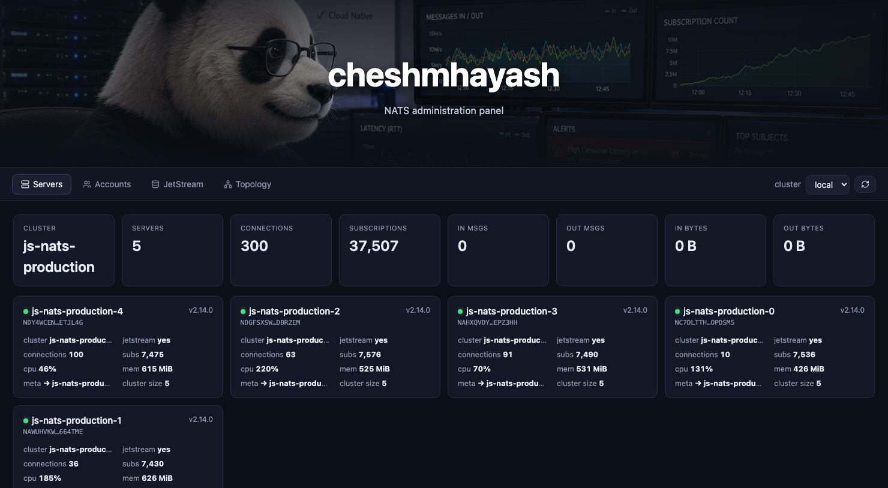
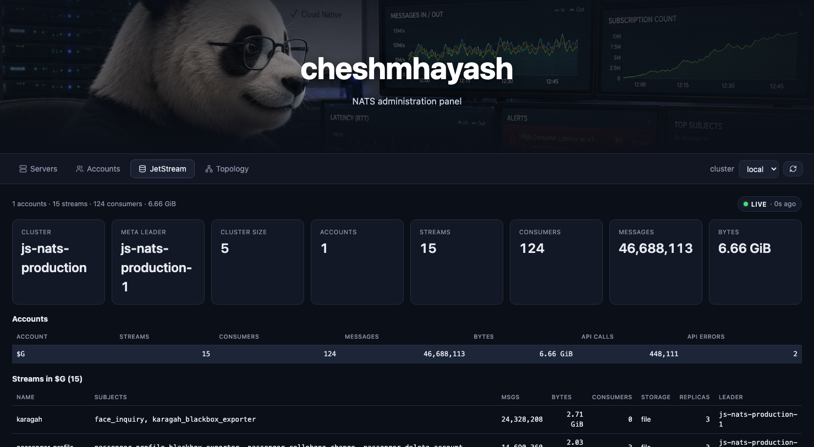
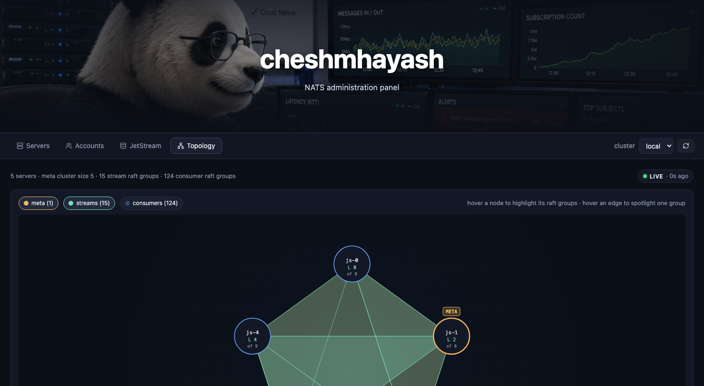

# cheshmhayash 👀

<p align="center">
  
</p>

<p align="center">
  <a href="https://github.com/1995parham/cheshmhayash/actions/workflows/ci.yaml"></a>
  
  
</p>

## Introducción

`cheshmhayash` es un panel de administración y gateway HTTP para NATS. Se comunica
con sus clústeres **a través del propio protocolo NATS** — utilizando los mismos
canales de cuenta de sistema (`$SYS.REQ.*`) y la API de JetStream (`$JS.API.*`) que
utiliza [`natscli`](https://github.com/nats-io/natscli) — y los expone como
HTTP + JSON simple para navegadores, scripts y herramientas internas.

Debido a que cada endpoint se sirve a través de una única conexión NATS
autenticada, **no** es necesario que el puerto de monitoreo HTTP del servidor (`:8222`)
esté abierto; solo se requiere el puerto del cliente (`:4222`, o donde sea que esté).

## Capturas de pantalla

<table>
  <tr>
    <td width="33%">
      <a href="./docs/screenshots/01-servers.png"></a>
      <p align="center"><sub><b>Servers</b> — cuadrícula de tarjetas de estadísticas por servidor con insignia de líder JS.</sub></p>
    </td>
    <td width="33%">
      <a href="./docs/screenshots/02-jetstream.png"></a>
      <p align="center"><sub><b>JetStream</b> — vista general del clúster, tabla de cuentas, detalle de streams. Indicador SSE en vivo arriba a la derecha.</sub></p>
    </td>
    <td width="33%">
      <a href="./docs/screenshots/03-topology.png"></a>
      <p align="center"><sub><b>Topology</b> — polígonos de raft-group que conectan los servidores (meta en ámbar, streams en verde, consumers en azul).</sub></p>
    </td>
  </tr>
</table>

## Características

### Endpoints de lectura

Las respuestas se reenvían textualmente desde el servidor NATS — la carga útil JSON es
la misma que obtendría de la interfaz de monitoreo HTTP.

- Descubrimiento de servidores en todo el clúster (`$SYS.REQ.SERVER.PING`)
- Endpoints específicos por servidor: `VARZ`, `CONNZ`, `ROUTEZ`, `GATEWAYZ`,
  `LEAFZ`, `SUBSZ`, `JSZ`, `ACCOUNTZ`, `HEALTHZ`, `STATSZ`
- Endpoints con alcance de cuenta: `CONNZ`, `LEAFZ`, `SUBSZ`, `JSZ`, `INFO`
- Vista general de JetStream en todo el clúster construida a partir de
  `$SYS.REQ.SERVER.PING.JSZ` — cada cuenta, cada stream, cada
  consumer, en un solo viaje de ida y vuelta
- JetStream: listar streams, información de stream, listar consumers, información de consumer

### Acciones

- Servidor: recargar configuración, modo lame-duck, expulsar una conexión por CID
- JetStream: **editar** configuración de stream (editor JSON de CodeMirror con resaltado de
  sintaxis), **ceder** el liderazgo de raft de meta/stream/consumer, purgar,
  eliminar, eliminar consumer

Las acciones destructivas de JetStream requieren `?confirm=true`; de lo contrario, el
servidor responde con `428 Precondition Required`.

### Integración en tiempo real + LLM

- La vista general de JSZ por clúster se actualiza en segundo plano y se envía a
  la SPA a través de SSE — el panel se actualiza en tiempo real, con un pequeño
  indicador `live` / `polling` / `disconnected` junto a cada vista.
- **Servidor MCP** como un binario independiente (`cheshmhayash-mcp`). Habla el Model
  Context Protocol tanto sobre stdio (por defecto) como HTTP Streamable
  (`-http`, `POST /mcp`) para que los agentes de LLM (Claude Desktop, Cursor, etc.) puedan
  inspeccionar y operar el clúster como herramientas. Solo lectura por defecto;
  los verbos destructivos dependen de `CHESHMHAYASH_MCP_WRITE=1`.
- **Notificaciones Webhook** a Slack / Mattermost / Matrix (vía puente hookshot): se suscribe a `$JS.EVENT.ADVISORY.>` y reporta la creación / eliminación / actualización / elección de líder / pérdida de cuórum de streams y consumers como mensajes de chat. Configuración bajo `[[notify]]`.

## API HTTP

| Método | Ruta | Notas |
| --- | --- | --- |
| `GET` | `/api/admin/clusters` | nombres de clústeres configurados |
| `GET` | `/api/admin/clusters/{c}/servers` | descubrimiento PING |
| `GET` | `/api/admin/clusters/{c}/servers/{endpoint}` | PING + endpoint (ej. `VARZ`) |
| `GET` | `/api/admin/clusters/{c}/servers/{id}/{endpoint}` | consulta de servidor específico |
| `GET` | `/api/admin/clusters/{c}/accounts/{account}/{endpoint}` | alcance de cuenta |
| `POST` | `/api/admin/clusters/{c}/servers/{id}/actions/reload` | recargar configuración |
| `POST` | `/api/admin/clusters/{c}/servers/{id}/actions/lame-duck` | drenado gradual |
| `POST` | `/api/admin/clusters/{c}/servers/{id}/actions/kick` | cuerpo: `{"cid": N}` |
| `GET` | `/api/jsm/clusters/{c}/overview` | JetStream global del clúster (cuenta-sys) · pasar `?live=true` para omitir caché |
| `GET` | `/api/jsm/clusters/{c}/overview/stream` | SSE — envía una vista general fresca en cada actualización de caché |
| `GET` | `/api/jsm/clusters/{c}/streams?offset=N` | paginado |
| `GET` | `/api/jsm/clusters/{c}/streams/{s}` | info del stream |
| `PUT` | `/api/jsm/clusters/{c}/streams/{s}` | actualización completa de `StreamConfig` |
| `POST` | `/api/jsm/clusters/{c}/streams/{s}/purge?confirm=true` | purgar todos los mensajes |
| `DELETE` | `/api/jsm/clusters/{c}/streams/{s}?confirm=true` | eliminar stream |
| `POST` | `/api/jsm/clusters/{c}/actions/meta-stepdown?confirm=true` | forzar re-elección de raft meta |
| `POST` | `/api/jsm/clusters/{c}/streams/{s}/actions/stepdown?confirm=true` | forzar re-elección de raft de stream |
| `GET` | `/api/jsm/clusters/{c}/streams/{s}/consumers?offset=N` | listar consumers |
| `GET` | `/api/jsm/clusters/{c}/streams/{s}/consumers/{con}` | info del consumer |
| `DELETE` | `/api/jsm/clusters/{c}/streams/{s}/consumers/{con}?confirm=true` | eliminar consumer |
| `POST` | `/api/jsm/clusters/{c}/streams/{s}/consumers/{con}/actions/stepdown?confirm=true` | forzar re-elección de raft de consumer |
| `POST` | `/mcp` | MCP Streamable HTTP — JSON-RPC 2.0 en el cuerpo |
| `GET` | `/mcp` | canal MCP SSE (notificaciones servidor→cliente) |
| `GET` | `/healthz` | sonda de liveness / readiness |

## Configuración

Los ajustes se cargan desde `config/default.toml`, se superponen con un opcional
`settings.toml`, y finalmente con variables de entorno con el prefijo
`CHESHMHAYASH__` (el doble guion bajo separa las claves anidadas; los elementos de lista
están indexados, ej. `CHESHMHAYASH__NATS__0__USER`).

```toml
[server]
host = "0.0.0.0"
port = 1378

# Cada bloque [[nats]] describe un clúster para administrar. La `url` apunta
# al puerto del cliente. Los endpoints administrativos ($SYS.REQ.*) requieren que la
# conexión esté autenticada contra la cuenta de sistema.
[[nats]]
name = "local"
url = "nats://127.0.0.1:4222"
# creds_file = "./sys.creds"
# user = "admin"
# password = "changeme"
# request_timeout_ms = 2000     # timeout de solicitud de respuesta única
# discovery_timeout_ms = 500    # ventana para recolección de respuestas múltiples

# Notificaciones Webhook — una entrada por destino de chat. `provider` es
# uno de slack | mattermost | matrix (Matrix espera un puente compatible con Slack
# como matrix-hookshot o maubot/webhook).
# [[notify]]
# provider = "slack"
# url = "https://hooks.slack.com/services/T000/B000/XXX"
# channel = "#nats-events"        # opcional
# username = "cheshmhayash"        # opcional
```

`CHESHMHAYASH_OVERVIEW_PERIOD` (duración de Go, por defecto `10s`) controla con qué
frecuencia se actualiza la caché de JSZ en segundo plano. `CHESHMHAYASH_MCP_WRITE=1`
habilita las herramientas destructivas de MCP.

### Requisito de cuenta de sistema

Los subjects `$SYS.REQ.*` solo se enrutan cuando el cliente que se conecta está vinculado
a la cuenta de sistema del servidor. Sin credenciales de cuenta de sistema, los
endpoints de administración agotan el tiempo de espera y la vista general de JetStream
global del clúster regresa vacía. Los endpoints `$JS.API.*` por cuenta (listar streams,
info de stream, actualizar/purgar/eliminar, consumers) se ejecutan contra cualquier
cuenta que otorguen las credenciales; devolverán `JetStream not enabled` (err_code
10039) en una conexión vinculada a `$SYS`.

## Stack Tecnológico

- **Backend** — Go 1.27, stdlib `net/http` (sintaxis de patrones 1.22+),
  `log/slog`, [`nats.go`](https://github.com/nats-io/nats.go) v1.52,
  `BurntSushi/toml` para configuración.
- **Frontend** — React 19 + TypeScript 6 en Vite 8. El editor JSON usa
  CodeMirror 6 (`@uiw/react-codemirror`, `@codemirror/lang-json`,
  `@codemirror/theme-one-dark`).
- **Imagen de Runtime** — `gcr.io/distroless/static-debian12:nonroot` (~10 MB).

## Ejecución

### Local

```sh
# Backend (dashboard)
go run ./cmd/cheshmhayash             # sirve API + SPA construida en :1378

# Frontend (dev — terminal separada)
cd frontend && npm install
npm run dev                           # HMR en :5173, /api proxied a :1378
```

Para una construcción de producción (el binario del dashboard sirve la API + SPA):

```sh
cd frontend && npm install && npm run build
go build -o ./bin/cheshmhayash ./cmd/cheshmhayash
./bin/cheshmhayash                    # http://127.0.0.1:1378
```

El servidor MCP es un binario separado (`cmd/cheshmhayash-mcp`) — stdio por
defecto, `-http` para el transporte HTTP Streamable:

```sh
go build -o ./bin/cheshmhayash-mcp ./cmd/cheshmhayash-mcp
./bin/cheshmhayash-mcp                # stdio (Claude Desktop, Cursor, …)
./bin/cheshmhayash-mcp -http          # POST /mcp en server.host:port
```

### Docker

```sh
docker build -t cheshmhayash .
docker run --rm -p 1378:1378 \
    -v "$PWD/settings.toml:/app/settings.toml:ro" \
    cheshmhayash
```

### Kubernetes (Helm)

El chart se encuentra en `chart/cheshmhayash-chart/` y se publica como un
artefacto OCI en GHCR en cada lanzamiento etiquetado.

```sh
# instalar desde GHCR
helm install panel \
  oci://ghcr.io/1995parham/cheshmhayash-chart \
  --version 1.8.0 \
  -f my-values.yaml

# o desde un checkout local
helm install panel chart/cheshmhayash-chart -f my-values.yaml
```

Los clústeres y el modo de autenticación se declaran en `values.yaml`. Cada entrada
se convierte en un bloque `[[nats]]`. `auth` acepta exactamente uno de tres modos —
`userPassword` (Secret gestionado por el chart), `existingSecret` (variables de entorno
de un Secret externo), o `credsFileSecret` (un archivo `.creds` montado como solo lectura):

```yaml
clusters:
  - name: prod
    url: nats://nats.nats.svc.cluster.local:4222
    auth:
      existingSecret:
        name: nats-prod-creds
        userKey: user
        passwordKey: password
```

El chart despliega solo el dashboard. El servidor MCP HTTP es un binario
separado, por lo que se incluye como una carga de trabajo opcional — configure
`mcp.enabled: true` para añadir un Deployment + Service de `cheshmhayash-mcp -http`.
Reutiliza la misma imagen, `settings.toml` y autenticación de NATS; la autenticación
de `/mcp` se configura bajo `auth.mcpKeys` / `auth.mcpOauth` / `auth.mcpJwt`, y las
herramientas de escritura dependen de `mcp.write`:

```yaml
mcp:
  enabled: true
  port: 8080
  write: false
```

## Desarrollo

```sh
# backend — golangci-lint es la única fuente de verdad para Go: ejecuta
# gofmt/goimports y go vet también, por lo que no hay pasos separados de fmt/vet.
golangci-lint run
go test -race ./...

# frontend — Biome es la única herramienta de lint + formato (reemplaza ESLint/Prettier)
cd frontend
npm run ci          # chequeo de biome lint + format
npm run typecheck
npm run build
```

Se incluye un `docker-compose.yml` para levantar un servidor NATS local
con el monitoreo habilitado, para que el dashboard tenga con quién hablar.

## Licencia

Libre y de código abierto **para siempre**, al igual que
[NATS](https://nats.io). Lanzado bajo la
[Licencia MIT](LICENSE) — consulte el archivo para más detalles.

---

<p align="center">
  Construido con ❤️ por <a href="https://github.com/1995parham">@1995parham</a> ·
  <a href="https://github.com/1995parham/cheshmhayash">1995parham/cheshmhayash</a>
</p>
